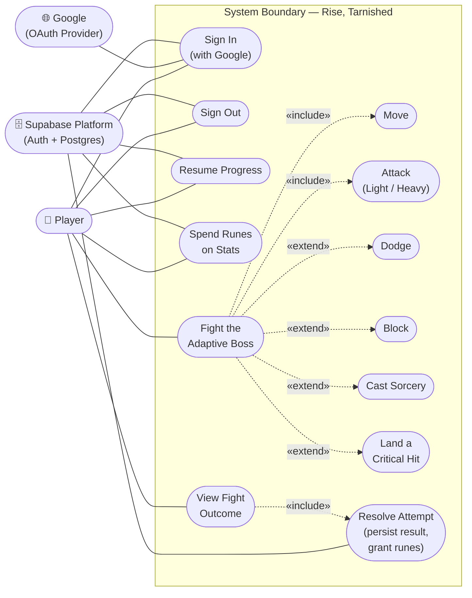

# Use Case Diagram

> Traced to: `src/app/page.tsx`, `src/app/play/page.tsx`,
> `src/app/auth/callback/route.ts`, `src/components/{AuthButton,
> CharacterSheet,PlayShell,GameCanvas}.tsx`,
> `src/game/scenes/CombatScene.ts`,
> `supabase/migrations/*.sql`. See `docs/uml-plan.md` §1 for the full
> include/extend reasoning.

**Notation note**: Mermaid has no native use-case-diagram syntax. This is
built with `flowchart` — actors as labelled boxes, use cases as stadium
(pill) shapes standing in for UML ovals, inside a `subgraph` standing in
for the system boundary. Solid lines are actor↔use-case associations;
dashed labelled arrows are `«include»`/`«extend»` relationships.

Scope is the shipped MVP loop only. The post-death LLM recap (issue #13)
and the headless bot-simulation harness (issue #14) are not implemented
and are deliberately excluded rather than diagrammed as if they existed.

## Actor summary

| Actor | Role |
|---|---|
| **Player** | Primary actor. The only human actor; every use case exists to serve a player goal. |
| **Google (OAuth Provider)** | Secondary actor. Supabase Auth's sole sign-in method (ADR-0003) — the system never handles a password directly. |
| **Supabase Platform** | Secondary actor. The auth/Postgres backend every persisted read or write goes through. Modeled outside the boundary because the use cases describe *player* goals, and Supabase is a service the system calls out to, not something the player touches directly. |

## Include/extend reasoning (the strict test applied)

A sub-behavior is `«include»`d only if it is performed, unconditionally, at
a defined point in **every** completed instance of the base use case.
Everything else that merely *can* happen is `«extend»`:

- **Move** and **Attack** — `«include»`. Winning "Fight the Adaptive Boss"
  requires reducing the boss's HP to 0, which is impossible without landing
  at least one attack; closing/holding distance is likewise unavoidable.
  Both are mandatory across a complete play-through.
- **Dodge**, **Block**, **Cast Sorcery** — `«extend»`. All three are
  player choices, not guaranteed steps: a high-vitality build can clear a
  fight tanking hits and never dodging; not every build blocks; casting is
  only reachable at all with intelligence invested in the build.
- **Land a Critical Hit** — `«extend»`. Only reachable when the boss's
  posture has broken (`isCriticalWindowOpen`); doesn't happen in every
  fight, and can fail to happen even in a won one.
- **Resolve Attempt** `«include»`s from **View Fight Outcome** — the
  outcome screen is exactly what triggers the `resolve_attempt` RPC call
  (`GameCanvas.tsx`), on every fight, win or lose.
