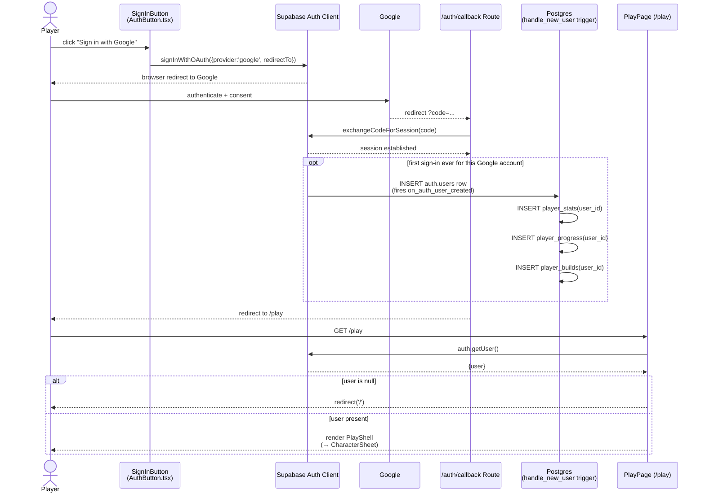

# Sequence Diagram — Sign In (with Google)

> Drawn by: Member A. Traced to: `src/components/AuthButton.tsx`
> (`SignInButton`), `src/lib/supabase/client.ts`,
> `src/app/auth/callback/route.ts`,
> `supabase/migrations/20260720193939_initial_schema.sql`
> (`handle_new_user` trigger + `on_auth_user_created`), `src/app/play/page.tsx`.

Chosen for the sequence (not communication) treatment because it's a
strictly time-ordered redirect chain across four hops (browser → Supabase
→ Google → callback route) — exactly what a vertical-timeline diagram
reads best. Per `docs/uml-plan.md` §3, sequence and communication diagrams
are semantically equivalent in UML 2.x; this is a notation choice, not a
technical necessity.

The trigger-provisioning step is wrapped in an `opt` fragment because it
only fires the very first time a given Google account signs in
(`on_auth_user_created` fires on `INSERT` into `auth.users`, not on every
login) — drawing it unconditionally would misrepresent the flow.

## Notes

- **No password ever touches this system.** ADR-0003's decision to use
  Google OAuth as the sole sign-in method means there's no credential
  input, storage, or verification code anywhere in this flow.
- **The trigger is `SECURITY DEFINER`**, so it runs with elevated
  privilege regardless of the new user's own (nonexistent, at that point)
  permissions — it's the one place the three per-user rows can be
  provisioned without a chicken-and-egg RLS problem.
- **`PlayPage` is a server component** (`await createClient()` uses the
  server-side Supabase client, cookie-based session) — the `auth.getUser()`
  call happens on the server before any HTML reaches the browser, not as a
  client-side check after the fact.
