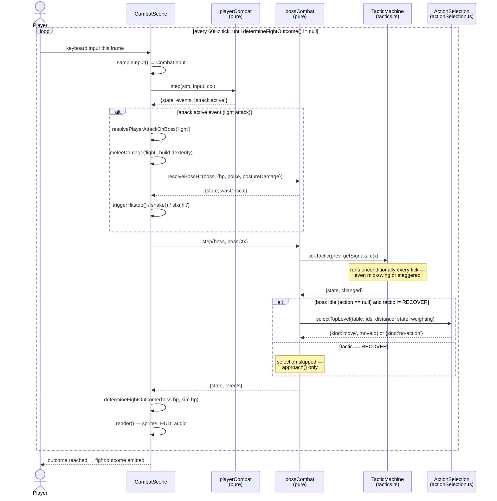

# Sequence Diagram — Fight the Adaptive Boss (one tick, a light attack connects)

> Drawn by: Member B. Traced to: `src/game/scenes/CombatScene.ts`
> (`update`, `resolvePlayerAttackOnBoss`), `src/game/combat/playerCombat.ts`
> (`step`), `src/game/boss/bossCombat.ts` (`step`, `resolveBossHit`),
> `src/game/boss/tactics.ts` (`tickTactic`),
> `src/game/boss/actionSelection.ts` (`selectTopLevel`),
> `src/game/attempt/outcome.ts` (`determineFightOutcome`).

Scope is deliberately **one representative tick**, not the whole multi-
minute fight — a sequence diagram trying to show "loop 3,600+ times" end to
end would be unreadable and would communicate less than one real tick
does. The 60Hz loop itself is the outer `loop` fragment; it repeats until
`determineFightOutcome` returns non-null (see UC-05 in
`02-use-case-description-fight-the-adaptive-boss.md` for the full
multi-tick use case).

## Notes

- **Client-authoritative, deterministic sim.** No network round-trip
  happens during the fight itself — `playerCombat.step` and
  `bossCombat.step` are pure functions over local state, which is what
  makes the fixed-timestep loop replayable from a seed.
- **The `RECOVER` branch is drawn explicitly** because it's the one place
  the boss's L3 (move selection) is skipped outright rather than merely
  filtered — the fix behind PR #48's "the boss now gives a smothered
  player real relief" behavior.
- **`meleeDamage` is the §6 stat-scaling formula**, not a flat number —
  `damage = weapon_base × (1 + coeff × softcap(dexterity)) × type_modifier`.
