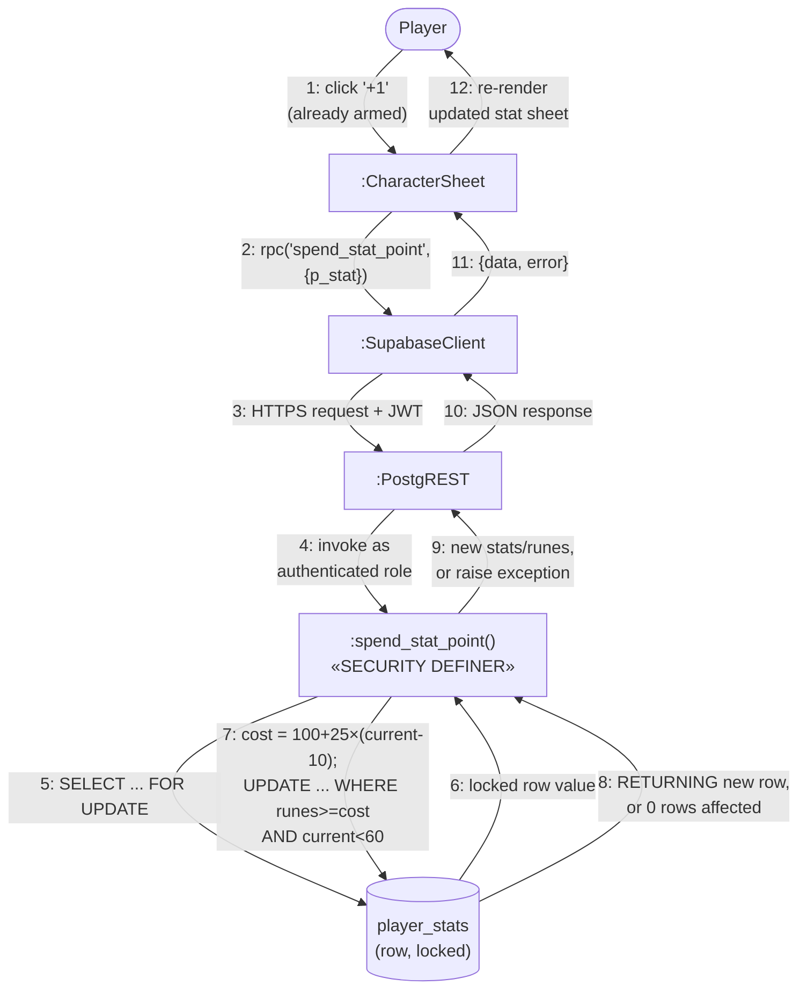

# Communication Diagram — Spend Runes on Stats

> Drawn by: Member C. Traced to: `src/components/CharacterSheet.tsx`
> (`confirmSpend`), `supabase/migrations/20260802120000_spend_stat_point.sql`.

Chosen for the communication (not sequence) treatment because its story is
about **which object owns which piece of validation** — the RPC vs. the
row it locks — which a hub-and-spoke object layout foregrounds more
naturally than a tall vertical timeline. Per `docs/uml-plan.md` §3,
sequence and communication diagrams carry the same information in UML
2.x; this is a notation choice made for exactly one reason: this use
case's interesting content is object collaboration, not message timing.

**Notation note**: Mermaid has no native communication-diagram syntax
either. This is built with `flowchart`, using numbered, labelled edges
between object nodes (`:ClassName` style labels, per UML's anonymous-
instance convention) in place of Mermaid's usual unlabelled-and-unordered
edges — the numbering is what actually carries the "communication diagram"
semantics here, not the shape of the graph.

## Notes

- **Message 5's row lock is the whole point of this diagram.** The cost of
  the *next* point in a stat depends on the stat's *current* value
  (`100 + 25×(current−10)`), so the value has to be read before it can be
  charged for. A plain `SELECT` first would reopen a race: two concurrent
  calls could both read the same pre-spend value, both compute the same
  (too-low) cost, and both pass a balance check against runes neither has
  actually paid yet. `SELECT ... FOR UPDATE` closes it — the second call
  blocks on the row lock until the first commits.
- **The client never supplies an amount** (ADR-0003) — `p_stat` selects
  *which* rule applies; the RPC computes cost and validates the hard cap
  (60) itself, server-side, every time. Message 2 carries no rune count.
- **No idempotency key**, unlike `resolve_attempt`. Spending is repeatable,
  not terminal: a dropped/retried call either succeeds once or fails
  cleanly with "not enough runes," with no double-spend risk to guard
  against.
