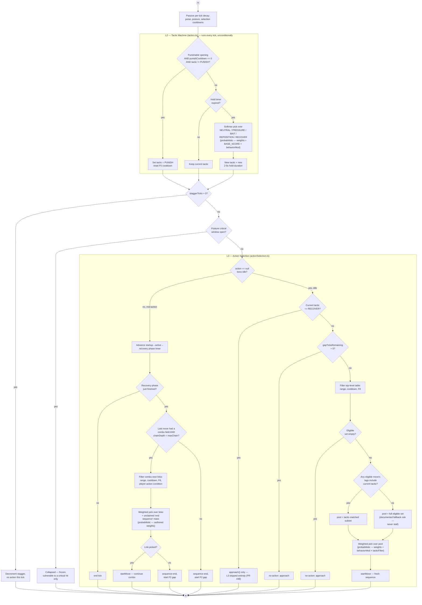

# Activity Diagram — Boss L2→L3 Decision Process (one tick)

> Traced to: `src/game/boss/bossCombat.ts` (`step`), `src/game/boss/tactics.ts`
> (`tickTactic`), `src/game/boss/actionSelection.ts` (`selectTopLevel`,
> `selectComboBranch`), `docs/design/BOSS_AI.md` §3–§4.

Chosen because this is explicitly the named criterion — "whose workflow or
decision-making process is best understood through an activity diagram."
Nothing else in the system comes close on decision density: a trigger-
priority check, a rate-limit guard, a hold-timer gate, a softmax-weighted
choice among five tactics, a range/cooldown/repeat-history filter over the
move table, a tactic-match filter with a documented fallback rule, a
weighted pick, and a *separate* combo-branch decision tree for follow-up
hits. A sequence diagram shows *who calls whom*; this shows *why the boss
picked what it picked* — the actual subject of the project's pitch.

**Two structural facts drawn from the real control flow, not assumed**
(both re-verified against `bossCombat.ts` before drawing):

1. **L2 (the tactic machine) runs every tick unconditionally** — before
   the stagger/collapsed/idle gates, not inside them. Intent can shift
   mid-swing or while staggered; only *actions* wait for the animation.
2. **`RECOVER` skips L3 entirely.** When the active tactic is `RECOVER`,
   the boss doesn't call move-selection with a biased weighting — it
   calls `approach()` and returns, full stop. This is the exact mechanism
   PR #48 fixed: before that fix, nothing in the system ever gave the
   player a tick where the boss wasn't trying to select *some* move.

**Notation caveat, on the diagram itself, not just here**: standard UML
decision nodes carry mutually-exclusive *boolean* guards. The two weighted
picks below (L2's softmax over tactics; L3's weighted pick over eligible
moves/combo links) are **probabilistic** — nothing about system state alone
determines the branch taken, only a distribution over branches does. Both
are labelled `{probabilistic}` rather than drawn like an ordinary `if`.

