# Class Diagram

> Traced to: `src/game/combat/playerCombat.ts`, `src/game/combat/posture.ts`,
> `src/game/boss/bossCombat.ts`, `src/game/boss/tactics.ts`,
> `src/game/boss/actionSelection.ts`, `src/game/boss/behaviorTracker.ts`,
> `src/game/boss/types.ts`, `src/game/bridge.ts`,
> `src/game/scenes/CombatScene.ts`, all three `supabase/migrations/*.sql`
> files. Every field, method, and relationship below was checked against
> source a second time after an initial pass produced three factual errors
> (see `docs/uml-plan.md`'s rigor-pass note) — nothing here is from memory.

## Modeling convention

The system is a **functional core / imperative shell** (ADR-0001): most
state is plain data (TypeScript `interface`s) transformed by pure
top-level functions, not objects with instance methods. Rather than invent
methods that don't exist, each state interface is modeled as a class with
its real fields as attributes and the actual pure functions that transform
it listed as its operations — the closest honest UML treatment of "what
this data's lifecycle is defined by." The two real OOP classes
(`GameBridge`, `CombatScene`) are drawn as themselves, unmodified.

```mermaid
classDiagram
    class PlayerCombatState {
        +x: number
        +facing: 1 | -1
        +hp: number
        +stamina: number
        +fp: number
        +action: ActiveAction?
        +poiseDamage: number
        +staggerTicks: number
        +ticksSinceStaminaSpend: number
        +ticksSinceFpSpend: number
        +projectiles: Projectile[]
        +nextProjectileId: number
        +createPlayerState(x, build?)$ PlayerCombatState
        +step(state, input, ctx)$ StepResult
        +poiseThreshold(build)$ number
        +isStaggered(state)$ boolean
        +isInvulnerable(state)$ boolean
        +resolveIncomingHit(state, incoming, build)$ HitResolution
    }

    class Projectile {
        +id: number
        +x: number
        +facing: 1 | -1
        +ticksAlive: number
        +damage: number
    }

    class StepContext {
        +build: PlayerBuild
        +minX: number
        +maxX: number
    }

    class PlayerBuild {
        +vitality: number
        +dexterity: number
        +intelligence: number
    }

    class BossCombatState {
        +x: number
        +facing: 1 | -1
        +hp: number
        +poiseDamage: number
        +posture: PostureState
        +action: BossActiveMove?
        +staggerTicks: number
        +selection: SelectionState
        +tactic: TacticState
        +tracker: TrackerState
        +createBossState(x, seed)$ BossCombatState
        +step(state, ctx)$ StepResult
        +resolveBossHit(state, incoming)$ BossHitResolution
        +isPunishableOpening(player, distance)$ boolean
    }

    class PostureState {
        +value: number
        +criticalTicks: number
        +createPostureState()$ PostureState
        +tickPosture(state)$ TickResult
        +applyPostureDamage(state, amount)$ TickResult
        +isCriticalWindowOpen(state)$ boolean
    }

    class TacticState {
        +current: Tactic
        +ticksInTactic: number
        +holdTicks: number
        +punishCooldown: number
        +rng: RngState
        +createTacticState(rng)$ TacticState
        +tickTactic(state, getSignals, ctx)$ TacticDecision
    }

    class SelectionState {
        +rng: RngState
        +cooldowns: Record~string, number~
        +chainDepth: number
        +recentMoves: string[]
        +gapTicksRemaining: number
        +createSelectionState(rng)$ SelectionState
        +selectTopLevel(table, ids, distance, state, weighting?)$ SelectionResult
        +selectComboBranch(table, distance, lastMoveId, state, lastPlayerAction)$ SelectionResult
    }

    class TrackerState {
        +buckets: Bucket[]
        +cursor: number
        +tickInBucket: number
        +ticksSinceBossStartup: number
        +createTracker()$ TrackerState
        +trackTick(state, observed)$ TrackerState
        +computeSignals(state)$ BehaviorSignals
    }

    class MoveDef {
        <<reference data>>
        +id: string
        +tags: MoveTag[]
        +tactics: Tactic[]
        +rangeBand: [number, number]
        +frames: FrameWindow
        +tellFrames: number
        +damage: number
        +poiseDamage: number
        +postureSelfRisk: number
        +staminaCost: number
        +combo: ComboDef?
        +cooldownTicks: number
        +comboOnly: boolean?
    }

    class GameBridge {
        +toGame: TypedEmitter~ShellToGameEvents~
        +toShell: TypedEmitter~GameToShellEvents~
        +dispose() void
    }

    class CombatScene {
        <<Phaser.Scene>>
        -sim: PlayerCombatState
        -boss: BossCombatState
        -ctx: StepContext
        -bossCtx: BossStepContext
        -bridge: GameBridge?
        -hitstopMs: number
        -deathAnimMs: number
        -finished: boolean
        -ready: boolean
        +preload() void
        +create() void
        +update(time, delta) void
        -startFight(payload) void
        -resolvePlayerAttackOnBoss(attackId) void
        -resolveBossAttackOnPlayer(move) void
        -reportOutcome(result) void
    }

    %% --- domain composition (owned, dies with the owner) ---
    PlayerCombatState "1" *-- "0..*" Projectile
    BossCombatState "1" *-- "1" PostureState
    BossCombatState "1" *-- "1" TacticState
    BossCombatState "1" *-- "1" SelectionState
    BossCombatState "1" *-- "1" TrackerState
    StepContext "1" o-- "1" PlayerBuild

    %% --- dependency (used as a parameter, never stored) ---
    PlayerCombatState ..> StepContext : step(state, input, ctx)
    SelectionState ..> MoveDef : selects (shared read-only table,\nnot owned per boss instance)

    %% --- CombatScene wiring ---
    CombatScene "1" o-- "1" PlayerCombatState
    CombatScene "1" o-- "1" BossCombatState
    CombatScene "1" --> "1" GameBridge
    CombatScene ..> StepContext : owns ctx

    %% --- persistence layer (Postgres) ---
    class AuthUser {
        <<Postgres, auth.users>>
        +id: uuid
    }
    class PlayerStats {
        <<table>>
        +user_id: uuid  PK/FK
        +vitality: integer
        +dexterity: integer
        +intelligence: integer
        +runes: bigint
        +updated_at: timestamptz
    }
    class PlayerProgress {
        <<table>>
        +user_id: uuid  PK/FK
        +current_region: region_id
        +regions_cleared: region_id[]
        +updated_at: timestamptz
    }
    class PlayerBuildRow {
        <<table, player_builds>>
        +id: uuid  PK
        +user_id: uuid  FK
        +weapon_id: text
        +is_active: boolean
        +created_at: timestamptz
    }
    class AttemptLog {
        <<table, attempt_logs>>
        +id: uuid  PK
        +user_id: uuid  FK
        +boss_id: text
        +result: text
        +duration_ticks: integer
        +rune_delta: integer
        +region_unlocked: boolean
        +log: jsonb
        +created_at: timestamptz
    }
    class Boss {
        <<table, bosses>>
        +id: text  PK
        +region_id: region_id
        +rune_reward: integer
    }

    AuthUser "1" -- "0..1" PlayerStats
    AuthUser "1" -- "0..1" PlayerProgress
    AuthUser "1" -- "0..*" PlayerBuildRow
    AuthUser "1" -- "0..*" AttemptLog
    AttemptLog "0..*" --> "1" Boss : boss_id «not FK-enforced»
```

## Relationship notes (why each line is drawn the way it is)

- **`PlayerCombatState *-- Projectile` is composition** — a sorcery bolt is
  spawned by, lives inside, and is consumed from exactly one player's
  state; it has no existence independent of it.
- **`BossCombatState`'s four `*--` lines are composition**, not
  aggregation — `createBossState()` constructs a fresh `PostureState`/
  `TacticState`/`SelectionState`/`TrackerState` every time, and none of the
  four is ever shared across boss instances.
- **`StepContext o-- PlayerBuild` is aggregation, not composition** — the
  build is read from `player_stats` and can outlive any single
  `StepContext` (the same build value is reused across many ticks'
  `StepContext`s, and it's the source of truth `CharacterSheet` displays
  independently of any fight).
- **`PlayerCombatState ..> StepContext` is a dependency, not an
  association** — `ctx` is a parameter to `step()`, never a field stored
  on `PlayerCombatState` itself. **Corrected from a first draft** that
  claimed a direct `PlayerCombatState --> PlayerBuild` association; that
  field doesn't exist on `PlayerCombatState` — checked directly.
- **No relationship is drawn between `BossCombatState` and `PlayerBuild`
  at all.** A first draft claimed one (`BossCombatState ..> PlayerBuild`);
  checked `BossStepContext` directly and it has no `build` field and no
  path to one — the boss's step function never reads the player's stat
  build.
- **`AttemptLog --> Boss` is a genuine association, correctly directed**
  (from the dependent `AttemptLog`, which holds a `boss_id` value that
  must resolve to a real `Boss`, to `Boss` itself) **and stereotyped
  `«not FK-enforced»`** — checked directly against the schema:
  `attempt_logs.boss_id` is `text not null` with no foreign key
  constraint; integrity is validated only inside `resolve_attempt`
  (`raise exception 'unknown boss_id: %'`), never by Postgres. A first
  draft had this both backwards (dependency arrow pointing the wrong way)
  and carrying multiplicity on a dependency, which isn't valid UML —
  multiplicity is an association-end concept.
- **`AuthUser -- PlayerStats`/`PlayerProgress` are `0..1`, not `1`** — the
  provisioning is an application-level trigger (`handle_new_user`), not a
  schema constraint; a `NOT NULL`-style guarantee doesn't exist at the DB
  level. `20260721150053_backfill_missing_player_rows.sql` exists
  precisely because pre-trigger accounts once had zero.
- **`SelectionState ..> MoveDef` is a dependency, not composition** — the
  move table (`margitMoves.ts`) is shared, read-only reference data keyed
  by move ID; a boss's `SelectionState` references it by ID
  (`cooldowns: Record<string, number>`, `recentMoves: string[]`) but
  doesn't own or contain any `MoveDef` instance.

## Deliberately excluded

The ~15 pure utility modules with no state of their own (`scaling.ts`,
`weighting.ts`, `reward.ts`, `outcome.ts`, `rng.ts`) are function libraries,
not classes — boxing them with no attributes would be padding, not
information. `CombatScene`'s ~40 private rendering-pool/sprite fields are
likewise omitted from its attribute list; only the fields load-bearing to
this diagram's story are shown, per `docs/uml-plan.md`'s stated scoping
rule.
